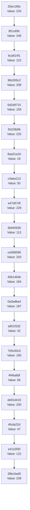

# Hash Chain Visualization

```mermaid
graph TD
    C0["39bc5ed0<br/>Value: 239"]
    C1["e4115f30<br/>Value: 122"]
    C1 --> C0
    C2["4fcda22d<br/>Value: 47"]
    C2 --> C1
    C3["de91d419<br/>Value: 200"]
    C3 --> C2
    C4["4f46a8df<br/>Value: 66"]
    C4 --> C3
    C5["705c93c5<br/>Value: 190"]
    C5 --> C4
    C6["a601f2d2<br/>Value: 42"]
    C6 --> C5
    C7["0a3adbed<br/>Value: 187"]
    C7 --> C6
    C8["40b1464b<br/>Value: 184"]
    C8 --> C7
    C9["ce568598<br/>Value: 203"]
    C9 --> C8
    C10["3b945936<br/>Value: 113"]
    C10 --> C9
    C11["e47d57df<br/>Value: 229"]
    C11 --> C10
    C12["c4aea113<br/>Value: 50"]
    C12 --> C11
    C13["8aa31a16<br/>Value: 19"]
    C13 --> C12
    C14["fd103b96<br/>Value: 225"]
    C14 --> C13
    C15["6d2d9715<br/>Value: 159"]
    C15 --> C14
    C16["98c005c2<br/>Value: 208"]
    C16 --> C15
    C17["6ca814f1<br/>Value: 122"]
    C17 --> C16
    C18["8f1cd0fc<br/>Value: 246"]
    C18 --> C17
    C19["25ec169c<br/>Value: 234"]
    C19 --> C18
```