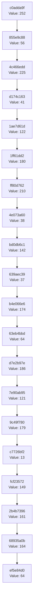

# Hash Chain Visualization

```mermaid
graph TD
    C0["ef5e84d0<br/>Value: 64"]
    C1["68935a0b<br/>Value: 164"]
    C1 --> C0
    C2["2b4b7396<br/>Value: 161"]
    C2 --> C1
    C3["fcf23572<br/>Value: 149"]
    C3 --> C2
    C4["c7726bf2<br/>Value: 13"]
    C4 --> C3
    C5["9c49f780<br/>Value: 179"]
    C5 --> C4
    C6["7e90ab95<br/>Value: 121"]
    C6 --> C5
    C7["d7e2b97e<br/>Value: 186"]
    C7 --> C6
    C8["63eb4bbd<br/>Value: 64"]
    C8 --> C7
    C9["b4e066e6<br/>Value: 174"]
    C9 --> C8
    C10["639aec39<br/>Value: 37"]
    C10 --> C9
    C11["bd0db6c1<br/>Value: 142"]
    C11 --> C10
    C12["4e073a60<br/>Value: 38"]
    C12 --> C11
    C13["ff80d762<br/>Value: 210"]
    C13 --> C12
    C14["1ff61dd2<br/>Value: 180"]
    C14 --> C13
    C15["1ae7d61d<br/>Value: 122"]
    C15 --> C14
    C16["d174c163<br/>Value: 41"]
    C16 --> C15
    C17["4c466edd<br/>Value: 225"]
    C17 --> C16
    C18["855e9c88<br/>Value: 56"]
    C18 --> C17
    C19["c0adda9f<br/>Value: 252"]
    C19 --> C18
```