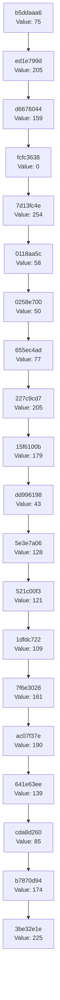

# Hash Chain Visualization

```mermaid
graph TD
    C0["3be32e1e<br/>Value: 225"]
    C1["b7870d94<br/>Value: 174"]
    C1 --> C0
    C2["cda8d260<br/>Value: 85"]
    C2 --> C1
    C3["641e63ee<br/>Value: 139"]
    C3 --> C2
    C4["ac07f37e<br/>Value: 190"]
    C4 --> C3
    C5["7f6e3028<br/>Value: 161"]
    C5 --> C4
    C6["1dfdc722<br/>Value: 109"]
    C6 --> C5
    C7["521c00f3<br/>Value: 121"]
    C7 --> C6
    C8["5e3e7a06<br/>Value: 128"]
    C8 --> C7
    C9["dd996198<br/>Value: 43"]
    C9 --> C8
    C10["15f6100b<br/>Value: 179"]
    C10 --> C9
    C11["227c9cd7<br/>Value: 205"]
    C11 --> C10
    C12["655ec4ad<br/>Value: 77"]
    C12 --> C11
    C13["0258e700<br/>Value: 50"]
    C13 --> C12
    C14["0118aa5c<br/>Value: 58"]
    C14 --> C13
    C15["7d13fc4e<br/>Value: 254"]
    C15 --> C14
    C16["fcfc3638<br/>Value: 0"]
    C16 --> C15
    C17["d6676044<br/>Value: 159"]
    C17 --> C16
    C18["ed1e799d<br/>Value: 205"]
    C18 --> C17
    C19["b5ddaaa6<br/>Value: 75"]
    C19 --> C18
```