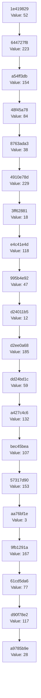

# Hash Chain Visualization

```mermaid
graph TD
    C0["a9785b9e<br/>Value: 28"]
    C1["d90f78e2<br/>Value: 117"]
    C1 --> C0
    C2["61cd5da6<br/>Value: 77"]
    C2 --> C1
    C3["9fb1291a<br/>Value: 167"]
    C3 --> C2
    C4["aa76bf1e<br/>Value: 3"]
    C4 --> C3
    C5["57317d90<br/>Value: 153"]
    C5 --> C4
    C6["bec45bea<br/>Value: 107"]
    C6 --> C5
    C7["a427c4c6<br/>Value: 132"]
    C7 --> C6
    C8["dd24bd1c<br/>Value: 59"]
    C8 --> C7
    C9["d2ee0a68<br/>Value: 185"]
    C9 --> C8
    C10["d24011b5<br/>Value: 12"]
    C10 --> C9
    C11["995b4e92<br/>Value: 47"]
    C11 --> C10
    C12["e4c41e4d<br/>Value: 118"]
    C12 --> C11
    C13["3ff62881<br/>Value: 18"]
    C13 --> C12
    C14["4910e78d<br/>Value: 229"]
    C14 --> C13
    C15["8763ada3<br/>Value: 38"]
    C15 --> C14
    C16["48f45a78<br/>Value: 84"]
    C16 --> C15
    C17["a54ff3db<br/>Value: 154"]
    C17 --> C16
    C18["644727f8<br/>Value: 223"]
    C18 --> C17
    C19["1e419829<br/>Value: 52"]
    C19 --> C18
```