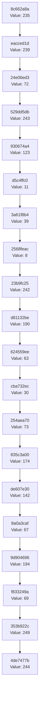

# Hash Chain Visualization

```mermaid
graph TD
    C0["4de7477b<br/>Value: 244"]
    C1["353b922c<br/>Value: 249"]
    C1 --> C0
    C2["f833249a<br/>Value: 69"]
    C2 --> C1
    C3["9d904696<br/>Value: 194"]
    C3 --> C2
    C4["8a0a3caf<br/>Value: 67"]
    C4 --> C3
    C5["de607e30<br/>Value: 142"]
    C5 --> C4
    C6["835c3a00<br/>Value: 174"]
    C6 --> C5
    C7["254aea70<br/>Value: 73"]
    C7 --> C6
    C8["cba732ec<br/>Value: 30"]
    C8 --> C7
    C9["624559ee<br/>Value: 63"]
    C9 --> C8
    C10["d81132be<br/>Value: 190"]
    C10 --> C9
    C11["23b9fc25<br/>Value: 242"]
    C11 --> C10
    C12["2568feac<br/>Value: 8"]
    C12 --> C11
    C13["3a61f8b4<br/>Value: 39"]
    C13 --> C12
    C14["d5c4ffc0<br/>Value: 11"]
    C14 --> C13
    C15["930674a4<br/>Value: 123"]
    C15 --> C14
    C16["529dd5db<br/>Value: 243"]
    C16 --> C15
    C17["24e06ed3<br/>Value: 72"]
    C17 --> C16
    C18["eacced1d<br/>Value: 239"]
    C18 --> C17
    C19["8c662a8a<br/>Value: 235"]
    C19 --> C18
```