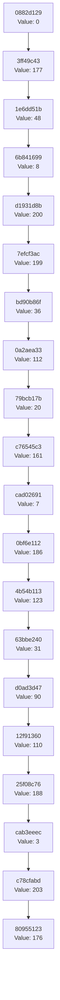

# Hash Chain Visualization

```mermaid
graph TD
    C0["80955123<br/>Value: 176"]
    C1["c78cfabd<br/>Value: 203"]
    C1 --> C0
    C2["cab3eeec<br/>Value: 3"]
    C2 --> C1
    C3["25f08c76<br/>Value: 188"]
    C3 --> C2
    C4["12f91360<br/>Value: 110"]
    C4 --> C3
    C5["d0ad3d47<br/>Value: 90"]
    C5 --> C4
    C6["63bbe240<br/>Value: 31"]
    C6 --> C5
    C7["4b54b113<br/>Value: 123"]
    C7 --> C6
    C8["0bf6e112<br/>Value: 186"]
    C8 --> C7
    C9["cad02691<br/>Value: 7"]
    C9 --> C8
    C10["c76545c3<br/>Value: 161"]
    C10 --> C9
    C11["79bcb17b<br/>Value: 20"]
    C11 --> C10
    C12["0a2aea33<br/>Value: 112"]
    C12 --> C11
    C13["bd90b86f<br/>Value: 36"]
    C13 --> C12
    C14["7efcf3ac<br/>Value: 199"]
    C14 --> C13
    C15["d1931d8b<br/>Value: 200"]
    C15 --> C14
    C16["6b841699<br/>Value: 8"]
    C16 --> C15
    C17["1e6dd51b<br/>Value: 48"]
    C17 --> C16
    C18["3ff49c43<br/>Value: 177"]
    C18 --> C17
    C19["0882d129<br/>Value: 0"]
    C19 --> C18
```