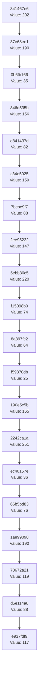

# Hash Chain Visualization

```mermaid
graph TD
    C0["e937fdf9<br/>Value: 117"]
    C1["d5e114a8<br/>Value: 88"]
    C1 --> C0
    C2["70672a21<br/>Value: 119"]
    C2 --> C1
    C3["1ae99098<br/>Value: 190"]
    C3 --> C2
    C4["66b5bd83<br/>Value: 76"]
    C4 --> C3
    C5["ec40157e<br/>Value: 36"]
    C5 --> C4
    C6["2242ca1a<br/>Value: 251"]
    C6 --> C5
    C7["190e5c5b<br/>Value: 165"]
    C7 --> C6
    C8["f59370db<br/>Value: 25"]
    C8 --> C7
    C9["8a897fc2<br/>Value: 64"]
    C9 --> C8
    C10["f15098b0<br/>Value: 74"]
    C10 --> C9
    C11["5ebb86c5<br/>Value: 220"]
    C11 --> C10
    C12["2ee95222<br/>Value: 147"]
    C12 --> C11
    C13["7bcbe9f7<br/>Value: 88"]
    C13 --> C12
    C14["c34e5025<br/>Value: 159"]
    C14 --> C13
    C15["d841437d<br/>Value: 82"]
    C15 --> C14
    C16["846d535b<br/>Value: 156"]
    C16 --> C15
    C17["0b6fb166<br/>Value: 35"]
    C17 --> C16
    C18["37e68ee1<br/>Value: 190"]
    C18 --> C17
    C19["341467e6<br/>Value: 202"]
    C19 --> C18
```