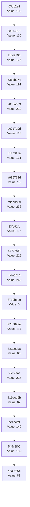

# Hash Chain Visualization

```mermaid
graph TD
    C0["a6a9f654<br/>Value: 83"]
    C1["545c8f06<br/>Value: 109"]
    C1 --> C0
    C2["be4ecfcf<br/>Value: 140"]
    C2 --> C1
    C3["819ecd9b<br/>Value: 62"]
    C3 --> C2
    C4["53e56fae<br/>Value: 217"]
    C4 --> C3
    C5["821ccaba<br/>Value: 65"]
    C5 --> C4
    C6["97bb829e<br/>Value: 114"]
    C6 --> C5
    C7["87d9bbee<br/>Value: 5"]
    C7 --> C6
    C8["4afa5516<br/>Value: 249"]
    C8 --> C7
    C9["477760f9<br/>Value: 215"]
    C9 --> C8
    C10["83fb91fc<br/>Value: 117"]
    C10 --> C9
    C11["c9c70e8d<br/>Value: 236"]
    C11 --> C10
    C12["a985762d<br/>Value: 15"]
    C12 --> C11
    C13["35cc341a<br/>Value: 131"]
    C13 --> C12
    C14["bc217a0d<br/>Value: 113"]
    C14 --> C13
    C15["a05da0b9<br/>Value: 219"]
    C15 --> C14
    C16["53cbb974<br/>Value: 191"]
    C16 --> C15
    C17["fdb47790<br/>Value: 176"]
    C17 --> C16
    C18["98114807<br/>Value: 110"]
    C18 --> C17
    C19["03dc2aff<br/>Value: 102"]
    C19 --> C18
```