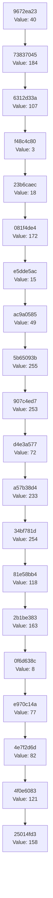

# Hash Chain Visualization

```mermaid
graph TD
    C0["25014fd3<br/>Value: 158"]
    C1["4f0e6083<br/>Value: 121"]
    C1 --> C0
    C2["4e7f2d6d<br/>Value: 82"]
    C2 --> C1
    C3["e970c14a<br/>Value: 77"]
    C3 --> C2
    C4["0f6d638c<br/>Value: 8"]
    C4 --> C3
    C5["2b1be383<br/>Value: 163"]
    C5 --> C4
    C6["81e58bb4<br/>Value: 118"]
    C6 --> C5
    C7["34bf781d<br/>Value: 254"]
    C7 --> C6
    C8["a57b38d4<br/>Value: 233"]
    C8 --> C7
    C9["d4e3a577<br/>Value: 72"]
    C9 --> C8
    C10["907c4ed7<br/>Value: 253"]
    C10 --> C9
    C11["5b65093b<br/>Value: 255"]
    C11 --> C10
    C12["ac9a0585<br/>Value: 49"]
    C12 --> C11
    C13["e5dde5ac<br/>Value: 15"]
    C13 --> C12
    C14["081f4de4<br/>Value: 172"]
    C14 --> C13
    C15["23b6caec<br/>Value: 18"]
    C15 --> C14
    C16["f48c4c80<br/>Value: 3"]
    C16 --> C15
    C17["6312d33a<br/>Value: 107"]
    C17 --> C16
    C18["73837045<br/>Value: 184"]
    C18 --> C17
    C19["9672ea23<br/>Value: 40"]
    C19 --> C18
```