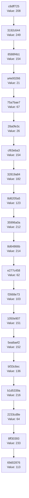

# Hash Chain Visualization

```mermaid
graph TD
    C0["69d02876<br/>Value: 113"]
    C1["8ff30393<br/>Value: 233"]
    C1 --> C0
    C2["2233cd8e<br/>Value: 64"]
    C2 --> C1
    C3["b1d5339a<br/>Value: 216"]
    C3 --> C2
    C4["bf33c6ec<br/>Value: 136"]
    C4 --> C3
    C5["5ea8aef2<br/>Value: 152"]
    C5 --> C4
    C6["1050e907<br/>Value: 151"]
    C6 --> C5
    C7["f2668e73<br/>Value: 103"]
    C7 --> C6
    C8["e277c458<br/>Value: 62"]
    C8 --> C7
    C9["8d64866b<br/>Value: 214"]
    C9 --> C8
    C10["35996a0a<br/>Value: 212"]
    C10 --> C9
    C11["8d6205a5<br/>Value: 123"]
    C11 --> C10
    C12["32819a84<br/>Value: 182"]
    C12 --> C11
    C13["cf63eba3<br/>Value: 154"]
    C13 --> C12
    C14["28a0fe3c<br/>Value: 26"]
    C14 --> C13
    C15["75a7bae7<br/>Value: 67"]
    C15 --> C14
    C16["a4e00266<br/>Value: 21"]
    C16 --> C15
    C17["8588f4b1<br/>Value: 154"]
    C17 --> C16
    C18["3192c644<br/>Value: 249"]
    C18 --> C17
    C19["c8dff725<br/>Value: 208"]
    C19 --> C18
```