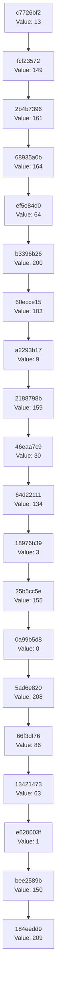

# Hash Chain Visualization

```mermaid
graph TD
    C0["184eedd9<br/>Value: 209"]
    C1["bee2589b<br/>Value: 150"]
    C1 --> C0
    C2["e620003f<br/>Value: 1"]
    C2 --> C1
    C3["13421473<br/>Value: 63"]
    C3 --> C2
    C4["66f3df76<br/>Value: 86"]
    C4 --> C3
    C5["5ad6e820<br/>Value: 208"]
    C5 --> C4
    C6["0a99b5d8<br/>Value: 0"]
    C6 --> C5
    C7["25b5cc5e<br/>Value: 155"]
    C7 --> C6
    C8["18976b39<br/>Value: 3"]
    C8 --> C7
    C9["64d22111<br/>Value: 134"]
    C9 --> C8
    C10["46eaa7c9<br/>Value: 30"]
    C10 --> C9
    C11["2188798b<br/>Value: 159"]
    C11 --> C10
    C12["a2293b17<br/>Value: 9"]
    C12 --> C11
    C13["60ecce15<br/>Value: 103"]
    C13 --> C12
    C14["b3396b26<br/>Value: 200"]
    C14 --> C13
    C15["ef5e84d0<br/>Value: 64"]
    C15 --> C14
    C16["68935a0b<br/>Value: 164"]
    C16 --> C15
    C17["2b4b7396<br/>Value: 161"]
    C17 --> C16
    C18["fcf23572<br/>Value: 149"]
    C18 --> C17
    C19["c7726bf2<br/>Value: 13"]
    C19 --> C18
```