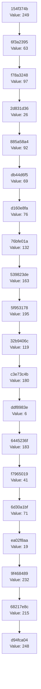

# Hash Chain Visualization

```mermaid
graph TD
    C0["d94fca04<br/>Value: 248"]
    C1["68217e8c<br/>Value: 215"]
    C1 --> C0
    C2["9f468489<br/>Value: 232"]
    C2 --> C1
    C3["ea02f8aa<br/>Value: 19"]
    C3 --> C2
    C4["6d30a1bf<br/>Value: 71"]
    C4 --> C3
    C5["f7965019<br/>Value: 41"]
    C5 --> C4
    C6["6445236f<br/>Value: 183"]
    C6 --> C5
    C7["ddf8983e<br/>Value: 6"]
    C7 --> C6
    C8["c3e73c4b<br/>Value: 180"]
    C8 --> C7
    C9["32b9406c<br/>Value: 119"]
    C9 --> C8
    C10["5f953178<br/>Value: 195"]
    C10 --> C9
    C11["539823de<br/>Value: 163"]
    C11 --> C10
    C12["76bfe01a<br/>Value: 132"]
    C12 --> C11
    C13["d160e8fa<br/>Value: 76"]
    C13 --> C12
    C14["db44d6f5<br/>Value: 69"]
    C14 --> C13
    C15["885a58a4<br/>Value: 92"]
    C15 --> C14
    C16["2d831d36<br/>Value: 26"]
    C16 --> C15
    C17["f78a3248<br/>Value: 97"]
    C17 --> C16
    C18["6f3a2395<br/>Value: 63"]
    C18 --> C17
    C19["154f374b<br/>Value: 249"]
    C19 --> C18
```