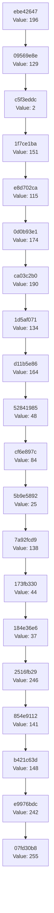

# Hash Chain Visualization

```mermaid
graph TD
    C0["07fd30b8<br/>Value: 255"]
    C1["e9976bdc<br/>Value: 242"]
    C1 --> C0
    C2["b421c63d<br/>Value: 148"]
    C2 --> C1
    C3["854e9112<br/>Value: 141"]
    C3 --> C2
    C4["2516fb29<br/>Value: 246"]
    C4 --> C3
    C5["184e36e6<br/>Value: 37"]
    C5 --> C4
    C6["173fb330<br/>Value: 44"]
    C6 --> C5
    C7["7a92fcd9<br/>Value: 138"]
    C7 --> C6
    C8["5b9e5892<br/>Value: 25"]
    C8 --> C7
    C9["cf6e897c<br/>Value: 84"]
    C9 --> C8
    C10["52841985<br/>Value: 48"]
    C10 --> C9
    C11["d11b5e86<br/>Value: 164"]
    C11 --> C10
    C12["1d5af071<br/>Value: 134"]
    C12 --> C11
    C13["ca03c2b0<br/>Value: 190"]
    C13 --> C12
    C14["0d0b93e1<br/>Value: 174"]
    C14 --> C13
    C15["e8d702ca<br/>Value: 115"]
    C15 --> C14
    C16["1f7ce1ba<br/>Value: 151"]
    C16 --> C15
    C17["c5f3eddc<br/>Value: 2"]
    C17 --> C16
    C18["09569e8e<br/>Value: 129"]
    C18 --> C17
    C19["ebe42647<br/>Value: 196"]
    C19 --> C18
```