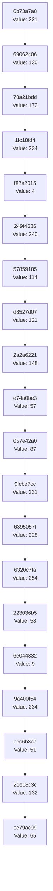

# Hash Chain Visualization

```mermaid
graph TD
    C0["ce79ac99<br/>Value: 65"]
    C1["21e18c3c<br/>Value: 132"]
    C1 --> C0
    C2["cec6b3c7<br/>Value: 51"]
    C2 --> C1
    C3["9a400f54<br/>Value: 234"]
    C3 --> C2
    C4["6e044332<br/>Value: 9"]
    C4 --> C3
    C5["223036b5<br/>Value: 58"]
    C5 --> C4
    C6["6320c7fa<br/>Value: 254"]
    C6 --> C5
    C7["6395057f<br/>Value: 228"]
    C7 --> C6
    C8["9fcbe7cc<br/>Value: 231"]
    C8 --> C7
    C9["057e42a0<br/>Value: 87"]
    C9 --> C8
    C10["e74a0be3<br/>Value: 57"]
    C10 --> C9
    C11["2a2a6221<br/>Value: 148"]
    C11 --> C10
    C12["d8527d07<br/>Value: 121"]
    C12 --> C11
    C13["57859185<br/>Value: 114"]
    C13 --> C12
    C14["249f4636<br/>Value: 240"]
    C14 --> C13
    C15["f82e2015<br/>Value: 4"]
    C15 --> C14
    C16["1fc18fd4<br/>Value: 234"]
    C16 --> C15
    C17["78a21bdd<br/>Value: 172"]
    C17 --> C16
    C18["69062406<br/>Value: 130"]
    C18 --> C17
    C19["6b73a7a8<br/>Value: 221"]
    C19 --> C18
```