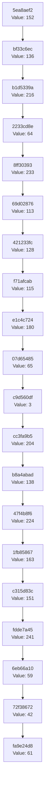

# Hash Chain Visualization

```mermaid
graph TD
    C0["fa9e24d8<br/>Value: 61"]
    C1["72f38672<br/>Value: 42"]
    C1 --> C0
    C2["6eb66a10<br/>Value: 59"]
    C2 --> C1
    C3["fdde7a45<br/>Value: 241"]
    C3 --> C2
    C4["c315d83c<br/>Value: 151"]
    C4 --> C3
    C5["1fb85867<br/>Value: 163"]
    C5 --> C4
    C6["47f4b8f6<br/>Value: 224"]
    C6 --> C5
    C7["b8a4abad<br/>Value: 138"]
    C7 --> C6
    C8["cc3fa9b5<br/>Value: 204"]
    C8 --> C7
    C9["c9d560df<br/>Value: 3"]
    C9 --> C8
    C10["07d65485<br/>Value: 65"]
    C10 --> C9
    C11["e1c4c724<br/>Value: 180"]
    C11 --> C10
    C12["f71afcab<br/>Value: 115"]
    C12 --> C11
    C13["421233fc<br/>Value: 128"]
    C13 --> C12
    C14["69d02876<br/>Value: 113"]
    C14 --> C13
    C15["8ff30393<br/>Value: 233"]
    C15 --> C14
    C16["2233cd8e<br/>Value: 64"]
    C16 --> C15
    C17["b1d5339a<br/>Value: 216"]
    C17 --> C16
    C18["bf33c6ec<br/>Value: 136"]
    C18 --> C17
    C19["5ea8aef2<br/>Value: 152"]
    C19 --> C18
```