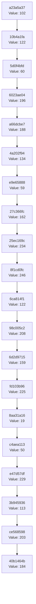

# Hash Chain Visualization

```mermaid
graph TD
    C0["40b1464b<br/>Value: 184"]
    C1["ce568598<br/>Value: 203"]
    C1 --> C0
    C2["3b945936<br/>Value: 113"]
    C2 --> C1
    C3["e47d57df<br/>Value: 229"]
    C3 --> C2
    C4["c4aea113<br/>Value: 50"]
    C4 --> C3
    C5["8aa31a16<br/>Value: 19"]
    C5 --> C4
    C6["fd103b96<br/>Value: 225"]
    C6 --> C5
    C7["6d2d9715<br/>Value: 159"]
    C7 --> C6
    C8["98c005c2<br/>Value: 208"]
    C8 --> C7
    C9["6ca814f1<br/>Value: 122"]
    C9 --> C8
    C10["8f1cd0fc<br/>Value: 246"]
    C10 --> C9
    C11["25ec169c<br/>Value: 234"]
    C11 --> C10
    C12["27c366fc<br/>Value: 162"]
    C12 --> C11
    C13["e9e65888<br/>Value: 59"]
    C13 --> C12
    C14["4a202f94<br/>Value: 134"]
    C14 --> C13
    C15["a66dcbe7<br/>Value: 188"]
    C15 --> C14
    C16["6023ae04<br/>Value: 196"]
    C16 --> C15
    C17["5d0f4bfd<br/>Value: 60"]
    C17 --> C16
    C18["10b4a1fa<br/>Value: 122"]
    C18 --> C17
    C19["a23a5a37<br/>Value: 102"]
    C19 --> C18
```