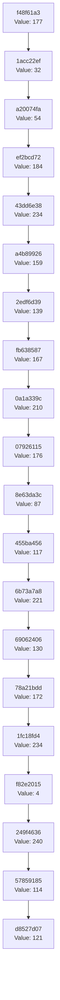

# Hash Chain Visualization

```mermaid
graph TD
    C0["d8527d07<br/>Value: 121"]
    C1["57859185<br/>Value: 114"]
    C1 --> C0
    C2["249f4636<br/>Value: 240"]
    C2 --> C1
    C3["f82e2015<br/>Value: 4"]
    C3 --> C2
    C4["1fc18fd4<br/>Value: 234"]
    C4 --> C3
    C5["78a21bdd<br/>Value: 172"]
    C5 --> C4
    C6["69062406<br/>Value: 130"]
    C6 --> C5
    C7["6b73a7a8<br/>Value: 221"]
    C7 --> C6
    C8["455ba456<br/>Value: 117"]
    C8 --> C7
    C9["8e63da3c<br/>Value: 87"]
    C9 --> C8
    C10["07926115<br/>Value: 176"]
    C10 --> C9
    C11["0a1a339c<br/>Value: 210"]
    C11 --> C10
    C12["fb638587<br/>Value: 167"]
    C12 --> C11
    C13["2edf6d39<br/>Value: 139"]
    C13 --> C12
    C14["a4b89926<br/>Value: 159"]
    C14 --> C13
    C15["43dd6e38<br/>Value: 234"]
    C15 --> C14
    C16["ef2bcd72<br/>Value: 184"]
    C16 --> C15
    C17["a20074fa<br/>Value: 54"]
    C17 --> C16
    C18["1acc22ef<br/>Value: 32"]
    C18 --> C17
    C19["f48f61a3<br/>Value: 177"]
    C19 --> C18
```