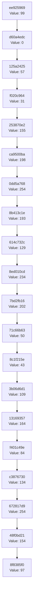

# Hash Chain Visualization

```mermaid
graph TD
    C0["8f8385f0<br/>Value: 97"]
    C1["48f0bd21<br/>Value: 154"]
    C1 --> C0
    C2["672817d9<br/>Value: 254"]
    C2 --> C1
    C3["c3876730<br/>Value: 134"]
    C3 --> C2
    C4["f401c49e<br/>Value: 84"]
    C4 --> C3
    C5["13169357<br/>Value: 164"]
    C5 --> C4
    C6["3b06d6d1<br/>Value: 109"]
    C6 --> C5
    C7["8c1f215e<br/>Value: 43"]
    C7 --> C6
    C8["71c66b63<br/>Value: 50"]
    C8 --> C7
    C9["7bd2fb16<br/>Value: 202"]
    C9 --> C8
    C10["8ed010cd<br/>Value: 234"]
    C10 --> C9
    C11["614c732c<br/>Value: 129"]
    C11 --> C10
    C12["8b413c1e<br/>Value: 193"]
    C12 --> C11
    C13["0dd5a768<br/>Value: 254"]
    C13 --> C12
    C14["ca9500ba<br/>Value: 198"]
    C14 --> C13
    C15["253870e2<br/>Value: 155"]
    C15 --> C14
    C16["f020c964<br/>Value: 31"]
    C16 --> C15
    C17["125a2425<br/>Value: 57"]
    C17 --> C16
    C18["d60a4edc<br/>Value: 0"]
    C18 --> C17
    C19["ee925969<br/>Value: 99"]
    C19 --> C18
```