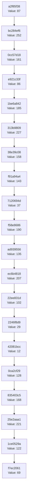

# Hash Chain Visualization

```mermaid
graph TD
    C0["f7ec2061<br/>Value: 69"]
    C1["1ce0529a<br/>Value: 122"]
    C1 --> C0
    C2["25e2aaa1<br/>Value: 221"]
    C2 --> C1
    C3["835403c5<br/>Value: 168"]
    C3 --> C2
    C4["0ca2cf29<br/>Value: 128"]
    C4 --> C3
    C5["42081bcc<br/>Value: 12"]
    C5 --> C4
    C6["2246f8d9<br/>Value: 29"]
    C6 --> C5
    C7["22ee831d<br/>Value: 102"]
    C7 --> C6
    C8["ec6b4818<br/>Value: 207"]
    C8 --> C7
    C9["ad939556<br/>Value: 135"]
    C9 --> C8
    C10["f58e8686<br/>Value: 190"]
    C10 --> C9
    C11["7120694d<br/>Value: 37"]
    C11 --> C10
    C12["f91a94a4<br/>Value: 143"]
    C12 --> C11
    C13["38e39c08<br/>Value: 158"]
    C13 --> C12
    C14["313b9809<br/>Value: 227"]
    C14 --> C13
    C15["1be6a842<br/>Value: 185"]
    C15 --> C14
    C16["e921c33f<br/>Value: 86"]
    C16 --> C15
    C17["0cc57d18<br/>Value: 161"]
    C17 --> C16
    C18["bc284ef6<br/>Value: 252"]
    C18 --> C17
    C19["a2f85f38<br/>Value: 87"]
    C19 --> C18
```