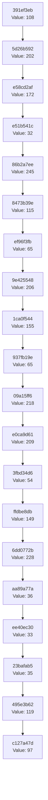

# Hash Chain Visualization

```mermaid
graph TD
    C0["c127a47d<br/>Value: 97"]
    C1["495e3b62<br/>Value: 119"]
    C1 --> C0
    C2["23bafab5<br/>Value: 35"]
    C2 --> C1
    C3["ee40ec30<br/>Value: 33"]
    C3 --> C2
    C4["aa89a77a<br/>Value: 36"]
    C4 --> C3
    C5["6dd0772b<br/>Value: 228"]
    C5 --> C4
    C6["ffdbe8db<br/>Value: 149"]
    C6 --> C5
    C7["3fbd34d6<br/>Value: 54"]
    C7 --> C6
    C8["e0ca9d61<br/>Value: 209"]
    C8 --> C7
    C9["09a15ff6<br/>Value: 218"]
    C9 --> C8
    C10["937fb19e<br/>Value: 65"]
    C10 --> C9
    C11["1ca0f544<br/>Value: 155"]
    C11 --> C10
    C12["9e425548<br/>Value: 206"]
    C12 --> C11
    C13["ef96f3fb<br/>Value: 65"]
    C13 --> C12
    C14["8473b39e<br/>Value: 115"]
    C14 --> C13
    C15["86b2a7ee<br/>Value: 245"]
    C15 --> C14
    C16["e51b541c<br/>Value: 32"]
    C16 --> C15
    C17["e58cd2af<br/>Value: 172"]
    C17 --> C16
    C18["5d26b592<br/>Value: 202"]
    C18 --> C17
    C19["391ef3eb<br/>Value: 108"]
    C19 --> C18
```