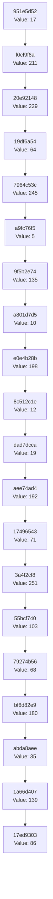

# Hash Chain Visualization

```mermaid
graph TD
    C0["17ed9303<br/>Value: 86"]
    C1["1a66d407<br/>Value: 139"]
    C1 --> C0
    C2["abda8aee<br/>Value: 35"]
    C2 --> C1
    C3["bf8d82e9<br/>Value: 180"]
    C3 --> C2
    C4["79274b56<br/>Value: 68"]
    C4 --> C3
    C5["55bcf740<br/>Value: 103"]
    C5 --> C4
    C6["3a4f2cf8<br/>Value: 251"]
    C6 --> C5
    C7["17496543<br/>Value: 71"]
    C7 --> C6
    C8["aee74ad4<br/>Value: 192"]
    C8 --> C7
    C9["dad7dcca<br/>Value: 19"]
    C9 --> C8
    C10["8c512c1e<br/>Value: 12"]
    C10 --> C9
    C11["e0e4b28b<br/>Value: 198"]
    C11 --> C10
    C12["a801d7d5<br/>Value: 10"]
    C12 --> C11
    C13["9f5b2e74<br/>Value: 135"]
    C13 --> C12
    C14["a9fc76f5<br/>Value: 5"]
    C14 --> C13
    C15["7964c53c<br/>Value: 245"]
    C15 --> C14
    C16["19df6a54<br/>Value: 64"]
    C16 --> C15
    C17["20e92148<br/>Value: 229"]
    C17 --> C16
    C18["f0cf9f6a<br/>Value: 211"]
    C18 --> C17
    C19["951e5d52<br/>Value: 17"]
    C19 --> C18
```