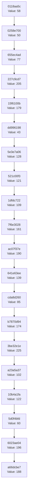

# Hash Chain Visualization

```mermaid
graph TD
    C0["a66dcbe7<br/>Value: 188"]
    C1["6023ae04<br/>Value: 196"]
    C1 --> C0
    C2["5d0f4bfd<br/>Value: 60"]
    C2 --> C1
    C3["10b4a1fa<br/>Value: 122"]
    C3 --> C2
    C4["a23a5a37<br/>Value: 102"]
    C4 --> C3
    C5["3be32e1e<br/>Value: 225"]
    C5 --> C4
    C6["b7870d94<br/>Value: 174"]
    C6 --> C5
    C7["cda8d260<br/>Value: 85"]
    C7 --> C6
    C8["641e63ee<br/>Value: 139"]
    C8 --> C7
    C9["ac07f37e<br/>Value: 190"]
    C9 --> C8
    C10["7f6e3028<br/>Value: 161"]
    C10 --> C9
    C11["1dfdc722<br/>Value: 109"]
    C11 --> C10
    C12["521c00f3<br/>Value: 121"]
    C12 --> C11
    C13["5e3e7a06<br/>Value: 128"]
    C13 --> C12
    C14["dd996198<br/>Value: 43"]
    C14 --> C13
    C15["15f6100b<br/>Value: 179"]
    C15 --> C14
    C16["227c9cd7<br/>Value: 205"]
    C16 --> C15
    C17["655ec4ad<br/>Value: 77"]
    C17 --> C16
    C18["0258e700<br/>Value: 50"]
    C18 --> C17
    C19["0118aa5c<br/>Value: 58"]
    C19 --> C18
```