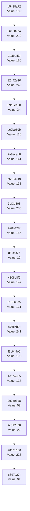

# Hash Chain Visualization

```mermaid
graph TD
    C0["68d7c27f<br/>Value: 94"]
    C1["43ba1d63<br/>Value: 228"]
    C1 --> C0
    C2["7cd27b68<br/>Value: 22"]
    C2 --> C1
    C3["0c230328<br/>Value: 59"]
    C3 --> C2
    C4["1c1c4955<br/>Value: 128"]
    C4 --> C3
    C5["f9c649e0<br/>Value: 190"]
    C5 --> C4
    C6["a76c7b9f<br/>Value: 241"]
    C6 --> C5
    C7["318363a5<br/>Value: 131"]
    C7 --> C6
    C8["4308c8f9<br/>Value: 147"]
    C8 --> C7
    C9["d8fccc77<br/>Value: 10"]
    C9 --> C8
    C10["928b428f<br/>Value: 155"]
    C10 --> C9
    C11["3df3b808<br/>Value: 235"]
    C11 --> C10
    C12["e6534619<br/>Value: 133"]
    C12 --> C11
    C13["7a8acad8<br/>Value: 141"]
    C13 --> C12
    C14["cc2be59b<br/>Value: 116"]
    C14 --> C13
    C15["09d6ea50<br/>Value: 34"]
    C15 --> C14
    C16["92442e10<br/>Value: 248"]
    C16 --> C15
    C17["1b3bdf5d<br/>Value: 186"]
    C17 --> C16
    C18["661589da<br/>Value: 212"]
    C18 --> C17
    C19["d5428a72<br/>Value: 108"]
    C19 --> C18
```