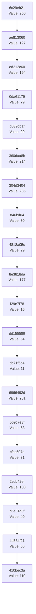

# Hash Chain Visualization

```mermaid
graph TD
    C0["410bec3a<br/>Value: 110"]
    C1["4d584f21<br/>Value: 56"]
    C1 --> C0
    C2["c6e31d8f<br/>Value: 40"]
    C2 --> C1
    C3["2edc42ef<br/>Value: 108"]
    C3 --> C2
    C4["cfac607c<br/>Value: 31"]
    C4 --> C3
    C5["569c7e3f<br/>Value: 63"]
    C5 --> C4
    C6["6966492d<br/>Value: 231"]
    C6 --> C5
    C7["dc71f5d4<br/>Value: 11"]
    C7 --> C6
    C8["dd155589<br/>Value: 54"]
    C8 --> C7
    C9["f29e7f78<br/>Value: 16"]
    C9 --> C8
    C10["8e3818da<br/>Value: 177"]
    C10 --> C9
    C11["4818a05c<br/>Value: 29"]
    C11 --> C10
    C12["846f9f04<br/>Value: 30"]
    C12 --> C11
    C13["304d3404<br/>Value: 235"]
    C13 --> C12
    C14["360daa8b<br/>Value: 214"]
    C14 --> C13
    C15["d039dd1f<br/>Value: 29"]
    C15 --> C14
    C16["0da61179<br/>Value: 79"]
    C16 --> C15
    C17["ed212c60<br/>Value: 194"]
    C17 --> C16
    C18["ae813060<br/>Value: 127"]
    C18 --> C17
    C19["6c29eb21<br/>Value: 250"]
    C19 --> C18
```