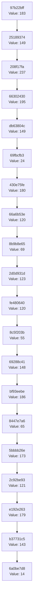

# Hash Chain Visualization

```mermaid
graph TD
    C0["6a0be7d8<br/>Value: 14"]
    C1["b37731c5<br/>Value: 143"]
    C1 --> C0
    C2["e192e263<br/>Value: 179"]
    C2 --> C1
    C3["2c92be93<br/>Value: 121"]
    C3 --> C2
    C4["5bbbb26e<br/>Value: 173"]
    C4 --> C3
    C5["8447e7a6<br/>Value: 65"]
    C5 --> C4
    C6["bf93eebe<br/>Value: 186"]
    C6 --> C5
    C7["69288c41<br/>Value: 148"]
    C7 --> C6
    C8["8c5f203b<br/>Value: 55"]
    C8 --> C7
    C9["fe480640<br/>Value: 120"]
    C9 --> C8
    C10["2d0d931d<br/>Value: 123"]
    C10 --> C9
    C11["8b9b8e65<br/>Value: 69"]
    C11 --> C10
    C12["66a6b53e<br/>Value: 120"]
    C12 --> C11
    C13["430e75fe<br/>Value: 180"]
    C13 --> C12
    C14["69fbcfb3<br/>Value: 24"]
    C14 --> C13
    C15["db63804c<br/>Value: 149"]
    C15 --> C14
    C16["66302430<br/>Value: 195"]
    C16 --> C15
    C17["208f17fa<br/>Value: 237"]
    C17 --> C16
    C18["25189374<br/>Value: 149"]
    C18 --> C17
    C19["97b22bff<br/>Value: 183"]
    C19 --> C18
```