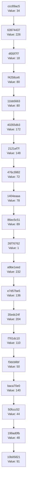

# Hash Chain Visualization

```mermaid
graph TD
    C0["10b05821<br/>Value: 91"]
    C1["199ad0fb<br/>Value: 48"]
    C1 --> C0
    C2["50fccc52<br/>Value: 44"]
    C2 --> C1
    C3["baca70e0<br/>Value: 140"]
    C3 --> C2
    C4["f3dcb8bf<br/>Value: 50"]
    C4 --> C3
    C5["f761dc10<br/>Value: 110"]
    C5 --> C4
    C6["35edc24f<br/>Value: 204"]
    C6 --> C5
    C7["e7d57be5<br/>Value: 136"]
    C7 --> C6
    C8["a9be1eed<br/>Value: 232"]
    C8 --> C7
    C9["26f76762<br/>Value: 1"]
    C9 --> C8
    C10["86ec5c51<br/>Value: 89"]
    C10 --> C9
    C11["1404eaaa<br/>Value: 78"]
    C11 --> C10
    C12["476c3982<br/>Value: 72"]
    C12 --> C11
    C13["2121ef7f<br/>Value: 148"]
    C13 --> C12
    C14["40265db3<br/>Value: 172"]
    C14 --> C13
    C15["11bb5663<br/>Value: 80"]
    C15 --> C14
    C16["f4258ce6<br/>Value: 80"]
    C16 --> C15
    C17["4f05f7f7<br/>Value: 18"]
    C17 --> C16
    C18["63974437<br/>Value: 226"]
    C18 --> C17
    C19["ccc89ac5<br/>Value: 34"]
    C19 --> C18
```