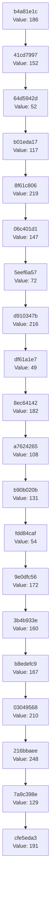

# Hash Chain Visualization

```mermaid
graph TD
    C0["cfe5eda3<br/>Value: 191"]
    C1["7a9c398e<br/>Value: 129"]
    C1 --> C0
    C2["216bbaee<br/>Value: 248"]
    C2 --> C1
    C3["03049568<br/>Value: 210"]
    C3 --> C2
    C4["b8edefc9<br/>Value: 167"]
    C4 --> C3
    C5["3b4b933e<br/>Value: 160"]
    C5 --> C4
    C6["9e0dfc56<br/>Value: 172"]
    C6 --> C5
    C7["fdd84caf<br/>Value: 54"]
    C7 --> C6
    C8["b90b020b<br/>Value: 131"]
    C8 --> C7
    C9["a7624265<br/>Value: 108"]
    C9 --> C8
    C10["8ec64142<br/>Value: 182"]
    C10 --> C9
    C11["df61a1e7<br/>Value: 49"]
    C11 --> C10
    C12["d910347b<br/>Value: 216"]
    C12 --> C11
    C13["5eef6a57<br/>Value: 72"]
    C13 --> C12
    C14["06c401d1<br/>Value: 147"]
    C14 --> C13
    C15["8f61c806<br/>Value: 219"]
    C15 --> C14
    C16["b01eda17<br/>Value: 117"]
    C16 --> C15
    C17["64d5942d<br/>Value: 52"]
    C17 --> C16
    C18["41cd7997<br/>Value: 152"]
    C18 --> C17
    C19["b4a81e1c<br/>Value: 186"]
    C19 --> C18
```