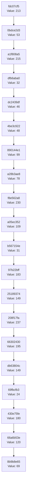

# Hash Chain Visualization

```mermaid
graph TD
    C0["8b9b8e65<br/>Value: 69"]
    C1["66a6b53e<br/>Value: 120"]
    C1 --> C0
    C2["430e75fe<br/>Value: 180"]
    C2 --> C1
    C3["69fbcfb3<br/>Value: 24"]
    C3 --> C2
    C4["db63804c<br/>Value: 149"]
    C4 --> C3
    C5["66302430<br/>Value: 195"]
    C5 --> C4
    C6["208f17fa<br/>Value: 237"]
    C6 --> C5
    C7["25189374<br/>Value: 149"]
    C7 --> C6
    C8["97b22bff<br/>Value: 183"]
    C8 --> C7
    C9["b567154e<br/>Value: 31"]
    C9 --> C8
    C10["a05ec352<br/>Value: 109"]
    C10 --> C9
    C11["f8e562a8<br/>Value: 230"]
    C11 --> C10
    C12["a28b3ae8<br/>Value: 78"]
    C12 --> C11
    C13["890144e1<br/>Value: 99"]
    C13 --> C12
    C14["4be3c922<br/>Value: 48"]
    C14 --> C13
    C15["dc2439df<br/>Value: 46"]
    C15 --> C14
    C16["dfb6aba0<br/>Value: 32"]
    C16 --> C15
    C17["a1f808a5<br/>Value: 215"]
    C17 --> C16
    C18["0bdce2d3<br/>Value: 53"]
    C18 --> C17
    C19["fdc07cf5<br/>Value: 213"]
    C19 --> C18
```