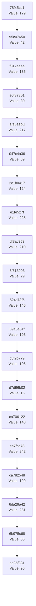

# Hash Chain Visualization

```mermaid
graph TD
    C0["ae35f881<br/>Value: 96"]
    C1["6b975c68<br/>Value: 55"]
    C1 --> C0
    C2["6da29a42<br/>Value: 231"]
    C2 --> C1
    C3["ca782548<br/>Value: 120"]
    C3 --> C2
    C4["ea7fca78<br/>Value: 242"]
    C4 --> C3
    C5["ca706122<br/>Value: 140"]
    C5 --> C4
    C6["d7d96b02<br/>Value: 15"]
    C6 --> C5
    C7["c5f2b779<br/>Value: 106"]
    C7 --> C6
    C8["69a5a51f<br/>Value: 193"]
    C8 --> C7
    C9["524c78f5<br/>Value: 146"]
    C9 --> C8
    C10["5f513993<br/>Value: 29"]
    C10 --> C9
    C11["df8ac353<br/>Value: 210"]
    C11 --> C10
    C12["e1fe527f<br/>Value: 228"]
    C12 --> C11
    C13["2c1b0417<br/>Value: 124"]
    C13 --> C12
    C14["047c4a36<br/>Value: 59"]
    C14 --> C13
    C15["5f6e659d<br/>Value: 217"]
    C15 --> C14
    C16["e0f87801<br/>Value: 80"]
    C16 --> C15
    C17["f812aaea<br/>Value: 135"]
    C17 --> C16
    C18["95c07650<br/>Value: 42"]
    C18 --> C17
    C19["78f45cc1<br/>Value: 179"]
    C19 --> C18
```