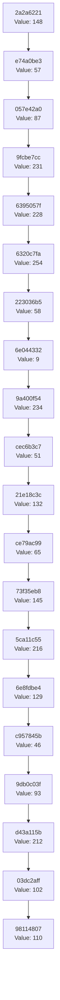

# Hash Chain Visualization

```mermaid
graph TD
    C0["98114807<br/>Value: 110"]
    C1["03dc2aff<br/>Value: 102"]
    C1 --> C0
    C2["d43a115b<br/>Value: 212"]
    C2 --> C1
    C3["9db0c03f<br/>Value: 93"]
    C3 --> C2
    C4["c957845b<br/>Value: 46"]
    C4 --> C3
    C5["6e8fdbe4<br/>Value: 129"]
    C5 --> C4
    C6["5ca11c55<br/>Value: 216"]
    C6 --> C5
    C7["73f35eb8<br/>Value: 145"]
    C7 --> C6
    C8["ce79ac99<br/>Value: 65"]
    C8 --> C7
    C9["21e18c3c<br/>Value: 132"]
    C9 --> C8
    C10["cec6b3c7<br/>Value: 51"]
    C10 --> C9
    C11["9a400f54<br/>Value: 234"]
    C11 --> C10
    C12["6e044332<br/>Value: 9"]
    C12 --> C11
    C13["223036b5<br/>Value: 58"]
    C13 --> C12
    C14["6320c7fa<br/>Value: 254"]
    C14 --> C13
    C15["6395057f<br/>Value: 228"]
    C15 --> C14
    C16["9fcbe7cc<br/>Value: 231"]
    C16 --> C15
    C17["057e42a0<br/>Value: 87"]
    C17 --> C16
    C18["e74a0be3<br/>Value: 57"]
    C18 --> C17
    C19["2a2a6221<br/>Value: 148"]
    C19 --> C18
```