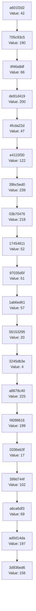

# Hash Chain Visualization

```mermaid
graph TD
    C0["3d936ed6<br/>Value: 156"]
    C1["ad0d14da<br/>Value: 197"]
    C1 --> C0
    C2["a6ca6df3<br/>Value: 69"]
    C2 --> C1
    C3["399d744f<br/>Value: 102"]
    C3 --> C2
    C4["0336eb3f<br/>Value: 17"]
    C4 --> C3
    C5["f4098616<br/>Value: 199"]
    C5 --> C4
    C6["a8678c40<br/>Value: 225"]
    C6 --> C5
    C7["3245db3e<br/>Value: 4"]
    C7 --> C6
    C8["56153295<br/>Value: 20"]
    C8 --> C7
    C9["1ab6ed61<br/>Value: 57"]
    C9 --> C8
    C10["97035d5f<br/>Value: 51"]
    C10 --> C9
    C11["17454811<br/>Value: 52"]
    C11 --> C10
    C12["03b70476<br/>Value: 218"]
    C12 --> C11
    C13["39bc5ed0<br/>Value: 239"]
    C13 --> C12
    C14["e4115f30<br/>Value: 122"]
    C14 --> C13
    C15["4fcda22d<br/>Value: 47"]
    C15 --> C14
    C16["de91d419<br/>Value: 200"]
    C16 --> C15
    C17["4f46a8df<br/>Value: 66"]
    C17 --> C16
    C18["705c93c5<br/>Value: 190"]
    C18 --> C17
    C19["a601f2d2<br/>Value: 42"]
    C19 --> C18
```