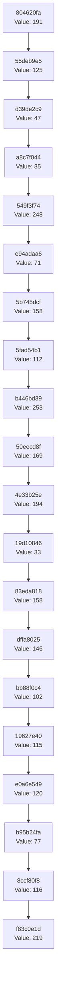

# Hash Chain Visualization

```mermaid
graph TD
    C0["f83c0e1d<br/>Value: 219"]
    C1["8ccf80f8<br/>Value: 116"]
    C1 --> C0
    C2["b95b24fa<br/>Value: 77"]
    C2 --> C1
    C3["e0a6e549<br/>Value: 120"]
    C3 --> C2
    C4["19627e40<br/>Value: 115"]
    C4 --> C3
    C5["bb88f0c4<br/>Value: 102"]
    C5 --> C4
    C6["dffa8025<br/>Value: 146"]
    C6 --> C5
    C7["83eda818<br/>Value: 158"]
    C7 --> C6
    C8["19d10846<br/>Value: 33"]
    C8 --> C7
    C9["4e33b25e<br/>Value: 194"]
    C9 --> C8
    C10["50eecd8f<br/>Value: 169"]
    C10 --> C9
    C11["b446bd39<br/>Value: 253"]
    C11 --> C10
    C12["5fad54b1<br/>Value: 112"]
    C12 --> C11
    C13["5b745dcf<br/>Value: 158"]
    C13 --> C12
    C14["e94adaa6<br/>Value: 71"]
    C14 --> C13
    C15["549f3f74<br/>Value: 248"]
    C15 --> C14
    C16["a8c7f044<br/>Value: 35"]
    C16 --> C15
    C17["d39de2c9<br/>Value: 47"]
    C17 --> C16
    C18["55deb9e5<br/>Value: 125"]
    C18 --> C17
    C19["804620fa<br/>Value: 191"]
    C19 --> C18
```