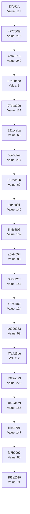

# Hash Chain Visualization

```mermaid
graph TD
    C0["253e2019<br/>Value: 74"]
    C1["fe7b20e7<br/>Value: 85"]
    C1 --> C0
    C2["fcb49791<br/>Value: 147"]
    C2 --> C1
    C3["40724ac9<br/>Value: 185"]
    C3 --> C2
    C4["3922aca3<br/>Value: 222"]
    C4 --> C3
    C5["47a425de<br/>Value: 2"]
    C5 --> C4
    C6["a6990263<br/>Value: 99"]
    C6 --> C5
    C7["e87ef4a2<br/>Value: 124"]
    C7 --> C6
    C8["308ce21f<br/>Value: 144"]
    C8 --> C7
    C9["a6a9f654<br/>Value: 83"]
    C9 --> C8
    C10["545c8f06<br/>Value: 109"]
    C10 --> C9
    C11["be4ecfcf<br/>Value: 140"]
    C11 --> C10
    C12["819ecd9b<br/>Value: 62"]
    C12 --> C11
    C13["53e56fae<br/>Value: 217"]
    C13 --> C12
    C14["821ccaba<br/>Value: 65"]
    C14 --> C13
    C15["97bb829e<br/>Value: 114"]
    C15 --> C14
    C16["87d9bbee<br/>Value: 5"]
    C16 --> C15
    C17["4afa5516<br/>Value: 249"]
    C17 --> C16
    C18["477760f9<br/>Value: 215"]
    C18 --> C17
    C19["83fb91fc<br/>Value: 117"]
    C19 --> C18
```