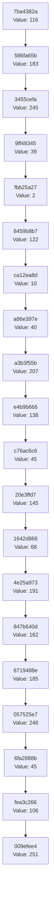

# Hash Chain Visualization

```mermaid
graph TD
    C0["009efee4<br/>Value: 251"]
    C1["fea3c266<br/>Value: 106"]
    C1 --> C0
    C2["6fa2888b<br/>Value: 45"]
    C2 --> C1
    C3["057525e7<br/>Value: 246"]
    C3 --> C2
    C4["8719488e<br/>Value: 185"]
    C4 --> C3
    C5["847b640d<br/>Value: 162"]
    C5 --> C4
    C6["4e25a973<br/>Value: 191"]
    C6 --> C5
    C7["1642d866<br/>Value: 68"]
    C7 --> C6
    C8["20e3ffd7<br/>Value: 145"]
    C8 --> C7
    C9["c76ac6c6<br/>Value: 45"]
    C9 --> C8
    C10["e4b9b666<br/>Value: 138"]
    C10 --> C9
    C11["a3b3f55b<br/>Value: 207"]
    C11 --> C10
    C12["a86e397e<br/>Value: 40"]
    C12 --> C11
    C13["ca12ea8d<br/>Value: 10"]
    C13 --> C12
    C14["8459b8b7<br/>Value: 122"]
    C14 --> C13
    C15["fbb25a27<br/>Value: 2"]
    C15 --> C14
    C16["9ff48345<br/>Value: 39"]
    C16 --> C15
    C17["3455cefa<br/>Value: 245"]
    C17 --> C16
    C18["586fa65b<br/>Value: 183"]
    C18 --> C17
    C19["7ba4382a<br/>Value: 116"]
    C19 --> C18
```