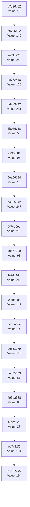

# Hash Chain Visualization

```mermaid
graph TD
    C0["b7122745<br/>Value: 194"]
    C1["eb7c22f6<br/>Value: 104"]
    C1 --> C0
    C2["f2b2c126<br/>Value: 28"]
    C2 --> C1
    C3["499ba338<br/>Value: 63"]
    C3 --> C2
    C4["5a0b5db9<br/>Value: 61"]
    C4 --> C3
    C5["9c551079<br/>Value: 113"]
    C5 --> C4
    C6["de6da69e<br/>Value: 14"]
    C6 --> C5
    C7["0fde53cb<br/>Value: 147"]
    C7 --> C6
    C8["fe94c4dc<br/>Value: 242"]
    C8 --> C7
    C9["a957722e<br/>Value: 93"]
    C9 --> C8
    C10["0f74d09e<br/>Value: 210"]
    C10 --> C9
    C11["d4905142<br/>Value: 247"]
    C11 --> C10
    C12["0ea06184<br/>Value: 15"]
    C12 --> C11
    C13["ae35f881<br/>Value: 96"]
    C13 --> C12
    C14["6b975c68<br/>Value: 55"]
    C14 --> C13
    C15["6da29a42<br/>Value: 231"]
    C15 --> C14
    C16["ca782548<br/>Value: 120"]
    C16 --> C15
    C17["ea7fca78<br/>Value: 242"]
    C17 --> C16
    C18["ca706122<br/>Value: 140"]
    C18 --> C17
    C19["d7d96b02<br/>Value: 15"]
    C19 --> C18
```