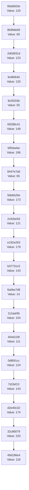

# Hash Chain Visualization

```mermaid
graph TD
    C0["49d186e4<br/>Value: 118"]
    C1["32c86079<br/>Value: 220"]
    C1 --> C0
    C2["d2e40c32<br/>Value: 174"]
    C2 --> C1
    C3["7d1fef13<br/>Value: 143"]
    C3 --> C2
    C4["0df691cc<br/>Value: 124"]
    C4 --> C3
    C5["404d11f8<br/>Value: 111"]
    C5 --> C4
    C6["112aaf4b<br/>Value: 154"]
    C6 --> C5
    C7["6a0be7d8<br/>Value: 14"]
    C7 --> C6
    C8["b37731c5<br/>Value: 143"]
    C8 --> C7
    C9["e192e263<br/>Value: 179"]
    C9 --> C8
    C10["2c92be93<br/>Value: 121"]
    C10 --> C9
    C11["5bbbb26e<br/>Value: 173"]
    C11 --> C10
    C12["8447e7a6<br/>Value: 65"]
    C12 --> C11
    C13["bf93eebe<br/>Value: 186"]
    C13 --> C12
    C14["69288c41<br/>Value: 148"]
    C14 --> C13
    C15["8c5f203b<br/>Value: 55"]
    C15 --> C14
    C16["fe480640<br/>Value: 120"]
    C16 --> C15
    C17["2d0d931d<br/>Value: 123"]
    C17 --> C16
    C18["8b9b8e65<br/>Value: 69"]
    C18 --> C17
    C19["66a6b53e<br/>Value: 120"]
    C19 --> C18
```