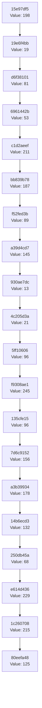

# Hash Chain Visualization

```mermaid
graph TD
    C0["80eefa48<br/>Value: 125"]
    C1["1c260708<br/>Value: 215"]
    C1 --> C0
    C2["e614d436<br/>Value: 229"]
    C2 --> C1
    C3["250db45a<br/>Value: 68"]
    C3 --> C2
    C4["14b6ecd3<br/>Value: 132"]
    C4 --> C3
    C5["a3b39934<br/>Value: 178"]
    C5 --> C4
    C6["7d6c9152<br/>Value: 156"]
    C6 --> C5
    C7["135cfe15<br/>Value: 96"]
    C7 --> C6
    C8["f9308ae1<br/>Value: 245"]
    C8 --> C7
    C9["5ff10606<br/>Value: 96"]
    C9 --> C8
    C10["4c205d3a<br/>Value: 21"]
    C10 --> C9
    C11["930ae7dc<br/>Value: 13"]
    C11 --> C10
    C12["a39d4cd7<br/>Value: 145"]
    C12 --> C11
    C13["f52fed3b<br/>Value: 89"]
    C13 --> C12
    C14["bb839b78<br/>Value: 187"]
    C14 --> C13
    C15["c1d2aeef<br/>Value: 211"]
    C15 --> C14
    C16["6961442b<br/>Value: 53"]
    C16 --> C15
    C17["d6f38101<br/>Value: 81"]
    C17 --> C16
    C18["19e6f4bb<br/>Value: 19"]
    C18 --> C17
    C19["15e97df5<br/>Value: 198"]
    C19 --> C18
```