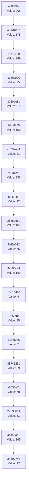

# Hash Chain Visualization

```mermaid
graph TD
    C0["35a977da<br/>Value: 17"]
    C1["4caa0ad8<br/>Value: 165"]
    C1 --> C0
    C2["27d35891<br/>Value: 51"]
    C2 --> C1
    C3["a5435e7c<br/>Value: 70"]
    C3 --> C2
    C4["4874525e<br/>Value: 29"]
    C4 --> C3
    C5["71f4d036<br/>Value: 2"]
    C5 --> C4
    C6["1f559fba<br/>Value: 95"]
    C6 --> C5
    C7["1591d4ac<br/>Value: 9"]
    C7 --> C6
    C8["44c95ca4<br/>Value: 169"]
    C8 --> C7
    C9["7fd8e012<br/>Value: 76"]
    C9 --> C8
    C10["2588a66b<br/>Value: 107"]
    C10 --> C9
    C11["d247f4f8<br/>Value: 12"]
    C11 --> C10
    C12["7e334ee5<br/>Value: 253"]
    C12 --> C11
    C13["cd297ab4<br/>Value: 31"]
    C13 --> C12
    C14["7dcf8805<br/>Value: 190"]
    C14 --> C13
    C15["3720ee8a<br/>Value: 219"]
    C15 --> C14
    C16["c33cc920<br/>Value: 95"]
    C16 --> C15
    C17["61af1909<br/>Value: 249"]
    C17 --> C16
    C18["a91d481b<br/>Value: 175"]
    C18 --> C17
    C19["ecff509a<br/>Value: 208"]
    C19 --> C18
```