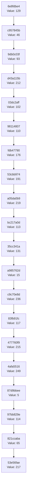

# Hash Chain Visualization

```mermaid
graph TD
    C0["53e56fae<br/>Value: 217"]
    C1["821ccaba<br/>Value: 65"]
    C1 --> C0
    C2["97bb829e<br/>Value: 114"]
    C2 --> C1
    C3["87d9bbee<br/>Value: 5"]
    C3 --> C2
    C4["4afa5516<br/>Value: 249"]
    C4 --> C3
    C5["477760f9<br/>Value: 215"]
    C5 --> C4
    C6["83fb91fc<br/>Value: 117"]
    C6 --> C5
    C7["c9c70e8d<br/>Value: 236"]
    C7 --> C6
    C8["a985762d<br/>Value: 15"]
    C8 --> C7
    C9["35cc341a<br/>Value: 131"]
    C9 --> C8
    C10["bc217a0d<br/>Value: 113"]
    C10 --> C9
    C11["a05da0b9<br/>Value: 219"]
    C11 --> C10
    C12["53cbb974<br/>Value: 191"]
    C12 --> C11
    C13["fdb47790<br/>Value: 176"]
    C13 --> C12
    C14["98114807<br/>Value: 110"]
    C14 --> C13
    C15["03dc2aff<br/>Value: 102"]
    C15 --> C14
    C16["d43a115b<br/>Value: 212"]
    C16 --> C15
    C17["9db0c03f<br/>Value: 93"]
    C17 --> C16
    C18["c957845b<br/>Value: 46"]
    C18 --> C17
    C19["6e8fdbe4<br/>Value: 129"]
    C19 --> C18
```