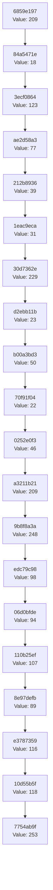

# Hash Chain Visualization

```mermaid
graph TD
    C0["7754ab9f<br/>Value: 253"]
    C1["10d55b5f<br/>Value: 118"]
    C1 --> C0
    C2["e3787359<br/>Value: 116"]
    C2 --> C1
    C3["8e97defb<br/>Value: 89"]
    C3 --> C2
    C4["110b25ef<br/>Value: 107"]
    C4 --> C3
    C5["06d0bfde<br/>Value: 94"]
    C5 --> C4
    C6["edc79c98<br/>Value: 98"]
    C6 --> C5
    C7["9b8f8a3a<br/>Value: 248"]
    C7 --> C6
    C8["a3211b21<br/>Value: 209"]
    C8 --> C7
    C9["0252e0f3<br/>Value: 46"]
    C9 --> C8
    C10["70f91f04<br/>Value: 22"]
    C10 --> C9
    C11["b00a3bd3<br/>Value: 50"]
    C11 --> C10
    C12["d2ebb11b<br/>Value: 23"]
    C12 --> C11
    C13["30d7362e<br/>Value: 229"]
    C13 --> C12
    C14["1eac9eca<br/>Value: 31"]
    C14 --> C13
    C15["212b8936<br/>Value: 39"]
    C15 --> C14
    C16["ae2d58a3<br/>Value: 77"]
    C16 --> C15
    C17["3ecf0864<br/>Value: 123"]
    C17 --> C16
    C18["84a5471e<br/>Value: 18"]
    C18 --> C17
    C19["6859e197<br/>Value: 209"]
    C19 --> C18
```