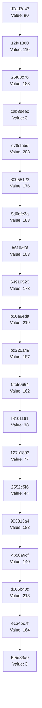

# Hash Chain Visualization

```mermaid
graph TD
    C0["5f5e83a9<br/>Value: 3"]
    C1["eca4bc7f<br/>Value: 164"]
    C1 --> C0
    C2["d005b40d<br/>Value: 218"]
    C2 --> C1
    C3["4618a9cf<br/>Value: 140"]
    C3 --> C2
    C4["993313a4<br/>Value: 188"]
    C4 --> C3
    C5["2552c5f6<br/>Value: 44"]
    C5 --> C4
    C6["127a1893<br/>Value: 77"]
    C6 --> C5
    C7["f6101161<br/>Value: 38"]
    C7 --> C6
    C8["0fe59664<br/>Value: 162"]
    C8 --> C7
    C9["bd225a49<br/>Value: 187"]
    C9 --> C8
    C10["b50a8eda<br/>Value: 219"]
    C10 --> C9
    C11["64919523<br/>Value: 178"]
    C11 --> C10
    C12["b610cf3f<br/>Value: 103"]
    C12 --> C11
    C13["9d0dfe3a<br/>Value: 183"]
    C13 --> C12
    C14["80955123<br/>Value: 176"]
    C14 --> C13
    C15["c78cfabd<br/>Value: 203"]
    C15 --> C14
    C16["cab3eeec<br/>Value: 3"]
    C16 --> C15
    C17["25f08c76<br/>Value: 188"]
    C17 --> C16
    C18["12f91360<br/>Value: 110"]
    C18 --> C17
    C19["d0ad3d47<br/>Value: 90"]
    C19 --> C18
```