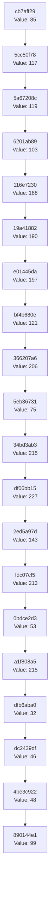

# Hash Chain Visualization

```mermaid
graph TD
    C0["890144e1<br/>Value: 99"]
    C1["4be3c922<br/>Value: 48"]
    C1 --> C0
    C2["dc2439df<br/>Value: 46"]
    C2 --> C1
    C3["dfb6aba0<br/>Value: 32"]
    C3 --> C2
    C4["a1f808a5<br/>Value: 215"]
    C4 --> C3
    C5["0bdce2d3<br/>Value: 53"]
    C5 --> C4
    C6["fdc07cf5<br/>Value: 213"]
    C6 --> C5
    C7["2ed5a97d<br/>Value: 143"]
    C7 --> C6
    C8["df06bb15<br/>Value: 227"]
    C8 --> C7
    C9["34bd3ab3<br/>Value: 215"]
    C9 --> C8
    C10["5eb36731<br/>Value: 75"]
    C10 --> C9
    C11["366207a6<br/>Value: 206"]
    C11 --> C10
    C12["bf4b680e<br/>Value: 121"]
    C12 --> C11
    C13["e01445da<br/>Value: 197"]
    C13 --> C12
    C14["19a41882<br/>Value: 190"]
    C14 --> C13
    C15["116e7230<br/>Value: 188"]
    C15 --> C14
    C16["6201ab89<br/>Value: 103"]
    C16 --> C15
    C17["5a67208c<br/>Value: 119"]
    C17 --> C16
    C18["5cc50f78<br/>Value: 117"]
    C18 --> C17
    C19["cb7aff29<br/>Value: 85"]
    C19 --> C18
```