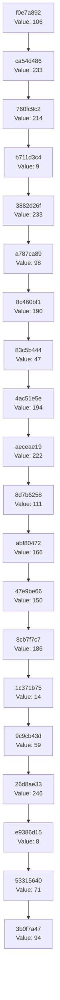

# Hash Chain Visualization

```mermaid
graph TD
    C0["3b0f7a47<br/>Value: 94"]
    C1["53315640<br/>Value: 71"]
    C1 --> C0
    C2["e9386d15<br/>Value: 8"]
    C2 --> C1
    C3["26d8ae33<br/>Value: 246"]
    C3 --> C2
    C4["9c9cb43d<br/>Value: 59"]
    C4 --> C3
    C5["1c371b75<br/>Value: 14"]
    C5 --> C4
    C6["8cb7f7c7<br/>Value: 186"]
    C6 --> C5
    C7["47e9be66<br/>Value: 150"]
    C7 --> C6
    C8["abf80472<br/>Value: 166"]
    C8 --> C7
    C9["8d7b6258<br/>Value: 111"]
    C9 --> C8
    C10["aeceae19<br/>Value: 222"]
    C10 --> C9
    C11["4ac51e5e<br/>Value: 194"]
    C11 --> C10
    C12["83c5b444<br/>Value: 47"]
    C12 --> C11
    C13["8c460bf1<br/>Value: 190"]
    C13 --> C12
    C14["a787ca89<br/>Value: 98"]
    C14 --> C13
    C15["3882d26f<br/>Value: 233"]
    C15 --> C14
    C16["b711d3c4<br/>Value: 9"]
    C16 --> C15
    C17["760fc9c2<br/>Value: 214"]
    C17 --> C16
    C18["ca54d486<br/>Value: 233"]
    C18 --> C17
    C19["f0e7a892<br/>Value: 106"]
    C19 --> C18
```