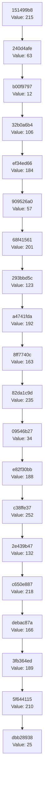

# Hash Chain Visualization

```mermaid
graph TD
    C0["dbb28938<br/>Value: 25"]
    C1["5f644115<br/>Value: 210"]
    C1 --> C0
    C2["3fb364ed<br/>Value: 189"]
    C2 --> C1
    C3["debac87a<br/>Value: 166"]
    C3 --> C2
    C4["c650e887<br/>Value: 218"]
    C4 --> C3
    C5["2e439b47<br/>Value: 132"]
    C5 --> C4
    C6["c38ffe37<br/>Value: 252"]
    C6 --> C5
    C7["e82f30bb<br/>Value: 188"]
    C7 --> C6
    C8["09546b27<br/>Value: 34"]
    C8 --> C7
    C9["82da1c9d<br/>Value: 235"]
    C9 --> C8
    C10["8ff7740c<br/>Value: 163"]
    C10 --> C9
    C11["a4741fda<br/>Value: 192"]
    C11 --> C10
    C12["293bbd5c<br/>Value: 123"]
    C12 --> C11
    C13["68f41561<br/>Value: 201"]
    C13 --> C12
    C14["909526a0<br/>Value: 57"]
    C14 --> C13
    C15["ef34ed66<br/>Value: 184"]
    C15 --> C14
    C16["32b0a6b4<br/>Value: 106"]
    C16 --> C15
    C17["b00f9797<br/>Value: 12"]
    C17 --> C16
    C18["240d4afe<br/>Value: 63"]
    C18 --> C17
    C19["151499b8<br/>Value: 215"]
    C19 --> C18
```