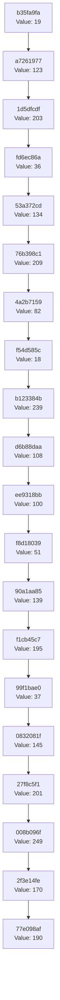

# Hash Chain Visualization

```mermaid
graph TD
    C0["77e098af<br/>Value: 190"]
    C1["2f3e14fe<br/>Value: 170"]
    C1 --> C0
    C2["008b096f<br/>Value: 249"]
    C2 --> C1
    C3["27f8c5f1<br/>Value: 201"]
    C3 --> C2
    C4["0832081f<br/>Value: 145"]
    C4 --> C3
    C5["99f1bae0<br/>Value: 37"]
    C5 --> C4
    C6["f1cb45c7<br/>Value: 195"]
    C6 --> C5
    C7["90a1aa85<br/>Value: 139"]
    C7 --> C6
    C8["f8d18039<br/>Value: 51"]
    C8 --> C7
    C9["ee9318bb<br/>Value: 100"]
    C9 --> C8
    C10["d6b88daa<br/>Value: 108"]
    C10 --> C9
    C11["b123384b<br/>Value: 239"]
    C11 --> C10
    C12["f54d585c<br/>Value: 18"]
    C12 --> C11
    C13["4a2b7159<br/>Value: 82"]
    C13 --> C12
    C14["76b398c1<br/>Value: 209"]
    C14 --> C13
    C15["53a372cd<br/>Value: 134"]
    C15 --> C14
    C16["fd6ec86a<br/>Value: 36"]
    C16 --> C15
    C17["1d5dfcdf<br/>Value: 203"]
    C17 --> C16
    C18["a7261977<br/>Value: 123"]
    C18 --> C17
    C19["b35fa9fa<br/>Value: 19"]
    C19 --> C18
```