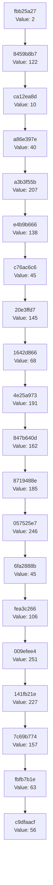

# Hash Chain Visualization

```mermaid
graph TD
    C0["c9dfaacf<br/>Value: 56"]
    C1["fbfb7b1e<br/>Value: 63"]
    C1 --> C0
    C2["7c69b774<br/>Value: 157"]
    C2 --> C1
    C3["141fb21e<br/>Value: 227"]
    C3 --> C2
    C4["009efee4<br/>Value: 251"]
    C4 --> C3
    C5["fea3c266<br/>Value: 106"]
    C5 --> C4
    C6["6fa2888b<br/>Value: 45"]
    C6 --> C5
    C7["057525e7<br/>Value: 246"]
    C7 --> C6
    C8["8719488e<br/>Value: 185"]
    C8 --> C7
    C9["847b640d<br/>Value: 162"]
    C9 --> C8
    C10["4e25a973<br/>Value: 191"]
    C10 --> C9
    C11["1642d866<br/>Value: 68"]
    C11 --> C10
    C12["20e3ffd7<br/>Value: 145"]
    C12 --> C11
    C13["c76ac6c6<br/>Value: 45"]
    C13 --> C12
    C14["e4b9b666<br/>Value: 138"]
    C14 --> C13
    C15["a3b3f55b<br/>Value: 207"]
    C15 --> C14
    C16["a86e397e<br/>Value: 40"]
    C16 --> C15
    C17["ca12ea8d<br/>Value: 10"]
    C17 --> C16
    C18["8459b8b7<br/>Value: 122"]
    C18 --> C17
    C19["fbb25a27<br/>Value: 2"]
    C19 --> C18
```