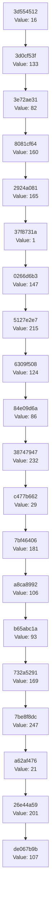

# Hash Chain Visualization

```mermaid
graph TD
    C0["de067b9b<br/>Value: 107"]
    C1["26e44a59<br/>Value: 201"]
    C1 --> C0
    C2["a62af476<br/>Value: 21"]
    C2 --> C1
    C3["7be8f8dc<br/>Value: 247"]
    C3 --> C2
    C4["732a5291<br/>Value: 169"]
    C4 --> C3
    C5["b65abc1a<br/>Value: 93"]
    C5 --> C4
    C6["a8ca8992<br/>Value: 106"]
    C6 --> C5
    C7["7bf46406<br/>Value: 181"]
    C7 --> C6
    C8["c477b662<br/>Value: 29"]
    C8 --> C7
    C9["38747947<br/>Value: 232"]
    C9 --> C8
    C10["84e09d6a<br/>Value: 86"]
    C10 --> C9
    C11["6309f508<br/>Value: 124"]
    C11 --> C10
    C12["5127e2e7<br/>Value: 215"]
    C12 --> C11
    C13["0266d6b3<br/>Value: 147"]
    C13 --> C12
    C14["37f8731a<br/>Value: 1"]
    C14 --> C13
    C15["2924a081<br/>Value: 165"]
    C15 --> C14
    C16["8081cf64<br/>Value: 160"]
    C16 --> C15
    C17["3e72ae31<br/>Value: 82"]
    C17 --> C16
    C18["3d0cf53f<br/>Value: 133"]
    C18 --> C17
    C19["3d554512<br/>Value: 16"]
    C19 --> C18
```