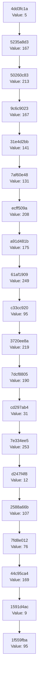

# Hash Chain Visualization

```mermaid
graph TD
    C0["1f559fba<br/>Value: 95"]
    C1["1591d4ac<br/>Value: 9"]
    C1 --> C0
    C2["44c95ca4<br/>Value: 169"]
    C2 --> C1
    C3["7fd8e012<br/>Value: 76"]
    C3 --> C2
    C4["2588a66b<br/>Value: 107"]
    C4 --> C3
    C5["d247f4f8<br/>Value: 12"]
    C5 --> C4
    C6["7e334ee5<br/>Value: 253"]
    C6 --> C5
    C7["cd297ab4<br/>Value: 31"]
    C7 --> C6
    C8["7dcf8805<br/>Value: 190"]
    C8 --> C7
    C9["3720ee8a<br/>Value: 219"]
    C9 --> C8
    C10["c33cc920<br/>Value: 95"]
    C10 --> C9
    C11["61af1909<br/>Value: 249"]
    C11 --> C10
    C12["a91d481b<br/>Value: 175"]
    C12 --> C11
    C13["ecff509a<br/>Value: 208"]
    C13 --> C12
    C14["7af60e48<br/>Value: 131"]
    C14 --> C13
    C15["31e4d2bb<br/>Value: 141"]
    C15 --> C14
    C16["9c6c9023<br/>Value: 167"]
    C16 --> C15
    C17["50260c83<br/>Value: 213"]
    C17 --> C16
    C18["5235a8d3<br/>Value: 167"]
    C18 --> C17
    C19["4dd3fc1a<br/>Value: 5"]
    C19 --> C18
```