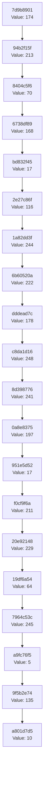

# Hash Chain Visualization

```mermaid
graph TD
    C0["a801d7d5<br/>Value: 10"]
    C1["9f5b2e74<br/>Value: 135"]
    C1 --> C0
    C2["a9fc76f5<br/>Value: 5"]
    C2 --> C1
    C3["7964c53c<br/>Value: 245"]
    C3 --> C2
    C4["19df6a54<br/>Value: 64"]
    C4 --> C3
    C5["20e92148<br/>Value: 229"]
    C5 --> C4
    C6["f0cf9f6a<br/>Value: 211"]
    C6 --> C5
    C7["951e5d52<br/>Value: 17"]
    C7 --> C6
    C8["0a8e8375<br/>Value: 197"]
    C8 --> C7
    C9["8d398776<br/>Value: 241"]
    C9 --> C8
    C10["c8da1d16<br/>Value: 248"]
    C10 --> C9
    C11["dddead7c<br/>Value: 178"]
    C11 --> C10
    C12["6b60520a<br/>Value: 222"]
    C12 --> C11
    C13["1a82dd3f<br/>Value: 244"]
    C13 --> C12
    C14["2e27c86f<br/>Value: 116"]
    C14 --> C13
    C15["bd832f45<br/>Value: 17"]
    C15 --> C14
    C16["6738df89<br/>Value: 168"]
    C16 --> C15
    C17["8404c5f6<br/>Value: 70"]
    C17 --> C16
    C18["94b2f15f<br/>Value: 213"]
    C18 --> C17
    C19["7d9b8901<br/>Value: 174"]
    C19 --> C18
```