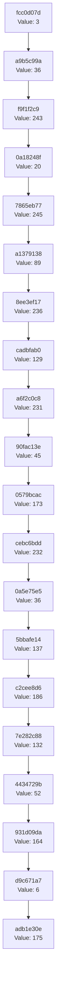

# Hash Chain Visualization

```mermaid
graph TD
    C0["adb1e30e<br/>Value: 175"]
    C1["d9c671a7<br/>Value: 6"]
    C1 --> C0
    C2["931d09da<br/>Value: 164"]
    C2 --> C1
    C3["4434729b<br/>Value: 52"]
    C3 --> C2
    C4["7e282c88<br/>Value: 132"]
    C4 --> C3
    C5["c2cee8d6<br/>Value: 186"]
    C5 --> C4
    C6["5bbafe14<br/>Value: 137"]
    C6 --> C5
    C7["0a5e75e5<br/>Value: 36"]
    C7 --> C6
    C8["cebc6bdd<br/>Value: 232"]
    C8 --> C7
    C9["0579bcac<br/>Value: 173"]
    C9 --> C8
    C10["90fac13e<br/>Value: 45"]
    C10 --> C9
    C11["a6f2c0c8<br/>Value: 231"]
    C11 --> C10
    C12["cadbfab0<br/>Value: 129"]
    C12 --> C11
    C13["8ee3ef17<br/>Value: 236"]
    C13 --> C12
    C14["a1379138<br/>Value: 89"]
    C14 --> C13
    C15["7865eb77<br/>Value: 245"]
    C15 --> C14
    C16["0a18248f<br/>Value: 20"]
    C16 --> C15
    C17["f9f1f2c9<br/>Value: 243"]
    C17 --> C16
    C18["a9b5c99a<br/>Value: 36"]
    C18 --> C17
    C19["fcc0d07d<br/>Value: 3"]
    C19 --> C18
```